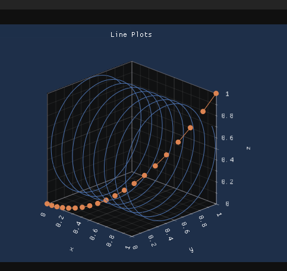

# xmake-implot3d

## source
- forked from
https://github.com/brenocq/implot3d

## depencency
- xmake packages
```lua
add_requires("imgui 1.91.5", {configs = {glfw= true,opengl3 = true,sdl2 = true}})
add_requires("glad 0.1.36")
```
- for more detail,see xmake-example

https://github.com/youngday/xmake-example

## build

```bash
xmake b plot
```
## run

```bash
xmake r plot
```
## result

 

## introduce

### main fun 
- run main window and demo sub window
src/plot/main_implot3d.cpp 

## demo fun
- run demo window,one or more
src/plot/implot3d_demo.cpp
```c++
void ShowDemoWindow(bool* p_open) {
    static bool show_imgui_demo = true;
    ImGui::ShowDemoWindow(&show_imgui_demo);


    ImGui::SetNextWindowPos(ImVec2(100, 100), ImGuiCond_FirstUseEver);
    ImGui::SetNextWindowSize(ImVec2(600, 750), ImGuiCond_FirstUseEver);
    ImGui::Begin("ImPlot3D Demo", p_open, ImGuiWindowFlags_MenuBar);

    ImGui::Text("ImPlot3D says ! (%s)", IMPLOT3D_VERSION);
    // DemoHeader("Line Plots", DemoLinePlots);need click
    DemoLinePlots();//one demo,need not click
    ImGui::Spacing();
    //  more demos
    // if (ImGui::BeginTabBar("ImPlot3DDemoTabs")) {
    //     if (ImGui::BeginTabItem("Plots")) {
    //         DemoHeader("Line Plots", DemoLinePlots);
    //         DemoHeader("Scatter Plots", DemoScatterPlots);
    //         DemoHeader("Triangle Plots", DemoTrianglePlots);
    //         DemoHeader("Quad Plots", DemoQuadPlots);
    //         DemoHeader("Surface Plots", DemoSurfacePlots);
    //         DemoHeader("Realtime Plots", DemoRealtimePlots);
    //         DemoHeader("Markers and Text", DemoMarkersAndText);
    //         DemoHeader("NaN Values", DemoNaNValues);
    //         ImGui::EndTabItem();
    //     }
    //     ImGui::EndTabBar();
    // }
    ImGui::End();
}
```
## alternative
you can also use

matplotplusplus

## thanks brenocq

⏰🔑
